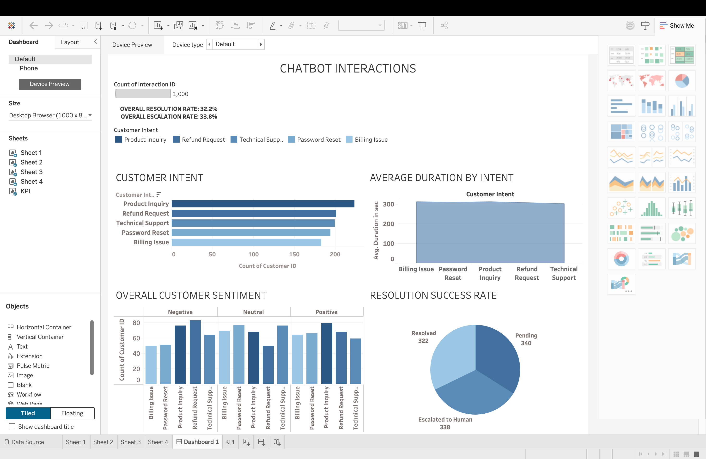

# 🤖 Multilingual Chatbot Interaction Analytics Pipeline

## 📌 Project Overview
This project is an end-to-end data analytics pipeline that captures and analyzes customer interactions with a multilingual support chatbot. The project demonstrates the complete data lifecycle: generating and extracting multi-turn interaction logs via Python, cleaning and validating data integrity using Pandas in Jupyter Notebook, and delivering actionable business insights through an interactive Tableau dashboard.

## 📊 Dashboard Preview
*(Interactive dashboard built in Tableau Desktop)*

## 🚀 Key Insights & Metrics
* **Resolution Success Rate:** 32.2% (322 interactions resolved automatically by the bot).
* **Escalation to Human:** 33.8% (338 interactions escalated, driven heavily by negative technical support inquiries).
* **Pending Tickets:** 34.0% (340 open/in-progress interactions).
* **Top Inquiries by Volume:** Product Inquiry (223), Refund Request (201), Technical Support (199), Password Reset (194), Billing Issue (183).
* **Average Chat Duration:** ~309.2 seconds across all customer intents.

## 🛠️ Tools & Technologies Used
* **Python:** Data generation scripts, API interaction, and automated log processing.
* **Pandas & NumPy:** Data cleaning, datetime parsing, missing-value validation, and distribution profiling.
* **Jupyter Notebook:** Exploratory Data Analysis (EDA) and cross-tabulation of sentiment vs. escalation rates.
* **Tableau Desktop:** Visual analytics, KPI scorecards, and interactive stakeholder dashboarding.
* **Large Language Models & APIs:** Integrated via Streamlit and Sarvam LLM API for realistic multi-turn conversational data.

## 📂 Repository Files
* `chatbot_data.csv`: Cleaned dataset containing 1,000 unique interaction logs (Intent, Duration, Sentiment, Resolution Status).
* `chatbot analyzed data.ipynb`: Jupyter Notebook with data validation checks, Pandas transformations, and statistical EDA.
* `chatbot interactions generation.py`: Python script used to simulate and generate the multi-turn interaction dataset.
* `dashboard.png`: Exported snapshot of the final Tableau dashboard.

## 📈 Key Workflow Steps
1. **Data Engineering & Ingestion:** Structured 1,000 multi-turn customer interaction records across 5 primary intent categories and 3 sentiment classifications.
2. **Data Validation & Cleaning:** Parsed timestamps into `datetime` format for time-series compatibility in Tableau, verified data types, and confirmed zero null values.
3. **Exploratory Data Analysis (EDA):** Profiled chat duration distributions and analyzed the direct correlation between negative customer sentiment and human escalation rates.
4. **Visual Analytics & Dashboarding:** Built an executive Tableau dashboard tracking operational KPIs (resolution rate, volume by intent, sentiment breakdown, average duration) for stakeholder decision-making.
